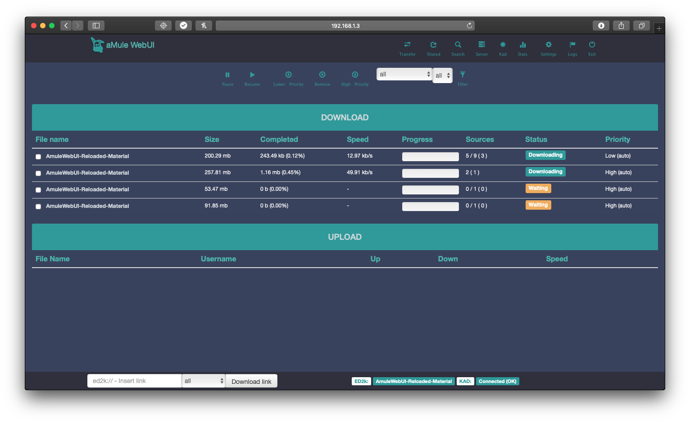

# ngosang/amule

[](https://github.com/ngosang/docker-amule/releases)
[](https://hub.docker.com/r/ngosang/amule/)
[](https://www.paypal.com/paypalme/diegoheras0xff)
[](https://www.blockchain.com/btc/address/14EcPN47rWXkmFvjfohJx2rQxxoeBRJhej)
[](https://www.blockchain.com/eth/address/0x0D1549BbB00926BF3D92c1A8A58695e982f1BE2E)

[aMule](https://github.com/amule-project/amule) is a multi-platform client for the ED2K file sharing network and based on the windows client eMule. aMule started in August 2003, as a fork of xMule, which is a fork of lMule.



Inspired by [tchabaud](https://github.com/tchabaud/dockerfiles/tree/master/amule) and [synopsis8](https://github.com/synopsis8/dockerfiles/tree/master/amule) work.

## Docker Registry

Docker images are available in [GHCR](https://github.com/users/ngosang/packages/container/package/amule) and [DockerHub](https://hub.docker.com/r/ngosang/amule).

```bash
docker pull ghcr.io/ngosang/amule
or
docker pull ngosang/amule
```

## Supported Architectures

The architectures supported by this image are:

* linux/amd64
* linux/arm/v6
* linux/arm/v7
* linux/arm64/v8
* linux/ppc64le
* linux/riscv64
* linux/s390x

## Application Setup

The web interface is at: `<your-ip>:4711`

For better download speed you have to open these ports:

* 4662 TCP
* 4665 UDP
* 4672 UDP

## Usage

Here are some example snippets to help you get started creating a container.

> [!NOTE]
> When you start aMule all shared folders are scanned. The user interface will not be available until the process is finished. You can check the logs and CPU usage to know the status.

### docker-compose

Compatible with docker-compose v2 schemas.

```yaml
---
services:
  amule:
    image: ngosang/amule
    container_name: amule
    environment:
      - PUID=1000
      - PGID=1000
      - TZ=Europe/London
      - GUI_PWD=<fill_password>
      - WEBUI_PWD=<fill_password>
      - MOD_AUTO_RESTART_ENABLED=true
      - MOD_AUTO_RESTART_CRON=0 6 * * *
      - MOD_AUTO_SHARE_ENABLED=false
      - MOD_AUTO_SHARE_DIRECTORIES=/incoming;/my_movies
      - MOD_FIX_KAD_GRAPH_ENABLED=true
      - MOD_FIX_KAD_BOOTSTRAP_ENABLED=true
    ports:
      - "4711:4711" # web ui
      - "4712:4712" # remote gui, webserver, cmd ...
      - "4662:4662" # ed2k tcp
      - "4665:4665/udp" # ed2k global search udp (tcp port +3)
      - "4672:4672/udp" # ed2k udp
    volumes:
      - <fill_amule_configuration_path>:/home/amule/.aMule
      - <fill_amule_completed_downloads_path>:/incoming
      - <fill_amule_incomplete_downloads_path>:/temp
    restart: unless-stopped
```

### docker cli

```bash
docker run -d \
  --name=amule \
  -p 4711:4711 \
  -p 4712:4712 \
  -p 4662:4662 \
  -p 4665:4665/udp \
  -p 4672:4672/udp \
  -e PUID=1000 \
  -e PGID=1000 \
  -e TZ=Europe/London \
  -e GUI_PWD=<fill_password> `#optional` \
  -e WEBUI_PWD=<fill_password> `#optional` \
  -e MOD_AUTO_RESTART_ENABLED=true `#optional` \
  -e 'MOD_AUTO_RESTART_CRON=0 6 * * *' `#optional` \
  -e MOD_AUTO_SHARE_ENABLED=false `#optional` \
  -e MOD_AUTO_SHARE_DIRECTORIES=/incoming;/my_movies `#optional` \
  -e MOD_FIX_KAD_GRAPH_ENABLED=true `#optional` \
  -e MOD_FIX_KAD_BOOTSTRAP_ENABLED=true `#optional` \
  -v <fill_amule_configuration_path>:/home/amule/.aMule \
  -v <fill_amule_completed_downloads_path>:/incoming \
  -v <fill_amule_incomplete_downloads_path>:/temp \
  --restart unless-stopped \
  ngosang/amule
```

## Parameters

Container images are configured using parameters passed at runtime (such as those above). These parameters are separated by a colon and indicate `<external>:<internal>` respectively. For example, `-p 8080:80` would expose port `80` from inside the container to be accessible from the host's IP on port `8080` outside the container.

| Parameter | Function |
| :----: | --- |
| `-p 4711` | Web UI port. |
| `-p 4712` | Remote gui, webserver, cmd port. |
| `-p 4662` | ED2K TCP port (must be open to Internet). |
| `-p 4665/udp` | ED2K global search UDP port (tcp port +3) (must be open to Internet). |
| `-p 4672/udp` | ED2K UDP port (must be open to Internet). |
| `-e PUID=1000` | for UserID - see below for explanation. |
| `-e PGID=1000` | for GroupID - see below for explanation. |
| `-e TZ=Europe/London` | Specify a timezone to use EG Europe/London. |
| `-e GUI_PWD=<fill_password>` | Set Remote GUI password. It will overwrite the password in the config files. |
| `-e WEBUI_PWD=<fill_password>` | Set Web UI password. It will overwrite the password in the config files. |
| `-e MOD_AUTO_RESTART_ENABLED=true` | Enable aMule auto restart. Check modifications section. |
| `-e 'MOD_AUTO_RESTART_CRON=0 6 * * *'` | aMule auto restart cron mask. Check modifications section. |
| `-e MOD_AUTO_SHARE_ENABLED=false` | Enable aMule auto share. Check modifications section. |
| `-e MOD_AUTO_SHARE_DIRECTORIES=/incoming;/my_movies` | aMule auto share directories with subdirectories. Check modifications section. |
| `-e MOD_FIX_KAD_GRAPH_ENABLED=true` | Fix Kad stats graph bug. Check modifications section. |
| `-e MOD_FIX_KAD_BOOTSTRAP_ENABLED=true` | Fix Kad bootstrap bug. Check modifications section. |
| `-v /home/amule/.aMule` | Path to save aMule configuration. |
| `-v /incoming` | Path to completed torrents. |
| `-v /temp` | Path to incomplete torrents. |

## User / Group Identifiers

When using volumes (`-v` flags) permissions issues can arise between the host OS and the container, we avoid this issue by allowing you to specify the user `PUID` and group `PGID`.

Ensure any volume directories on the host are owned by the same user you specify and any permissions issues will vanish like magic.

In this instance `PUID=1000` and `PGID=1000`, to find yours use `id user` as below:

```bash
  $ id username
    uid=1000(dockeruser) gid=1000(dockergroup) groups=1000(dockergroup)
```

## Modifications

The Docker image includes some unofficial features. All of them are optional.

### aMule Web UI Reloaded theme

The Docker image includes the classic aMule Web UI and [AmuleWebUI-Reloaded](https://github.com/MatteoRagni/AmuleWebUI-Reloaded) theme.

You can change the theme editing the `amule.conf` file and changing `Template=AmuleWebUI-Reloaded`. Let this option empty to use the default theme.

### Auto restart mod

aMule has some issues that cause it to stop working properly after a few days:
* [Memory leak](https://github.com/amule-project/amule/issues/314)
* [Network disconnection](https://github.com/amule-project/amule/issues/315)

As workaround, we have implemented a cron scheduler to restart aMule from time to time. To enable this mod set these environment variables:
* `MOD_AUTO_RESTART_ENABLED=true`
* `MOD_AUTO_RESTART_CRON=0 6 * * *` => Cron mask is configurable. In the example it restarts everyday at 6:00h.

### Auto share mod

By default, aMule only shares "incoming" directory and shared folders cannot be selected in the Web UI

We have added this option in the Docker image. The configuration is updated when the container starts. Note that sub-directories are also shared!
* `MOD_AUTO_SHARE_ENABLED=true`
* `MOD_AUTO_SHARE_DIRECTORIES=/incoming;/my_movies` => List of directories separated by semicolon ';'. Subdirectories will be shared too.

### Fix Kad stats graph mod

aMule has an issue when it renders Kad stats graph that [crash the application](https://github.com/amule-project/amule/issues/265). The crash happens when you enter in the Web UI stats after few days running.

As workaround, we removed the image causing the issue from the Web UI. Since the image is not requested the server doesn't crash.
* `MOD_FIX_KAD_GRAPH_ENABLED=true`

### Fix Kad bootstrap mod

aMule [does not download the nodes.dat file](https://github.com/ngosang/docker-amule/issues/33) required to bootstrap the Kad network. This causes it not to connect to the Kad network.

As workaround, we are downloading the `nodes.dat` file before starting aMule. The file is only downloaded if it has not been downloaded before.
* `MOD_FIX_KAD_BOOTSTRAP_ENABLED=true`
