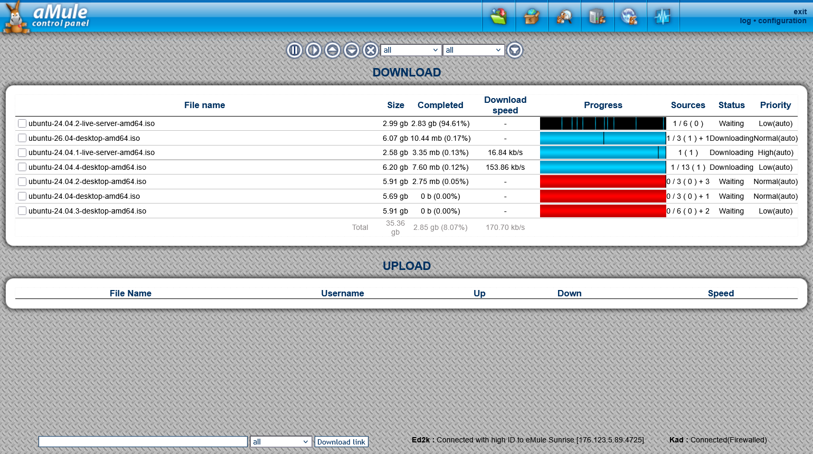

# ngosang/amule

[](https://github.com/ngosang/docker-amule/releases)
[](https://hub.docker.com/r/ngosang/amule)
[](https://hub.docker.com/r/ngosang/amule)
[](https://github.com/ngosang/docker-amule)

[](https://ko-fi.com/ngosang)

[aMule](https://github.com/amule-org/amule) is a multi-platform client for the ED2K file sharing network and based on the windows client eMule. aMule started in August 2003, as a fork of xMule, which is a fork of lMule.



## Docker Images

The image is based on `debian:trixie-slim` and compiles aMule from source code.

Docker images are available in [DockerHub](https://hub.docker.com/r/ngosang/amule) and [GHCR](https://github.com/users/ngosang/packages/container/package/amule).

```bash
docker pull ngosang/amule
# or
docker pull ghcr.io/ngosang/amule
```

### Docker Tags

Stable:
* `latest` — Latest stable release.
* `3.0.0-1` — Specific stable version.

Development:
* `develop` — Latest development build (compiled from aMule master branch).
* `develop-20260512-abc1234` — Specific development build: date + aMule upstream commit.

Debug:
* `debug` — Latest debug build (compiled from aMule master branch).
* `debug-20260512-abc1234` — Specific debug build: date + aMule upstream commit.

> [!NOTE]
> The `debug` images are compiled in **Debug** mode (`CMAKE_BUILD_TYPE=Debug`, full symbols, no optimizations) and ship with the debugging tools `gdb`, `strace`, `lsof` and `heaptrack` preinstalled, so you can debug crashes and memory issues of the aMule development builds. As a result they are larger and slower than the `stable` and `develop` images and are not intended for production use. The `stable` and `develop` images are regular optimized builds without these tools.

### Supported Architectures

The architectures supported by this image are:

* linux/386
* linux/amd64
* linux/arm/v5
* linux/arm/v7
* linux/arm64/v8
* linux/ppc64le
* linux/riscv64
* linux/s390x

## Application Setup

The web interface is at: `<your-ip>:4711`

> [!NOTE]
> If you don't set `GUI_PWD` / `WEBUI_PWD`, a random password is generated on the first start and printed to the container logs. Run `docker logs amule` to retrieve it.

For better download speed you have to open these ports:

* 4662 TCP
* 4665 UDP
* 4672 UDP

## Usage

Here are some example snippets to help you get started creating a container.

> [!NOTE]
> When you start aMule all shared folders are scanned. The user interface will not be available until the process is finished. You can check the logs and CPU usage to know the status.

### docker-compose

Compatible with docker-compose v2 schemas.

```yaml
---
services:
  amule:
    image: ngosang/amule
    container_name: amule
    environment:
      - PUID=1000
      - PGID=1000
      - TZ=Europe/London
      - GUI_PWD=<fill_password>
      - WEBUI_PWD=<fill_password>
      - MOD_AUTO_RESTART_ENABLED=true
      - MOD_AUTO_RESTART_CRON=0 6 * * *
      - MOD_AUTO_SHARE_ENABLED=false
      - MOD_AUTO_SHARE_DIRECTORIES=/downloads/incoming;/my_movies
    ports:
      - "4711:4711" # Web interface (amuleweb)
      - "4712:4712" # External connections (amulegui, amulecmd, amuleweb)
      - "4662:4662" # ED2K client-to-client TCP (required for High ID)
      - "4665:4665/udp" # ED2K server UDP (global searches, TCP port +3)
      - "4672:4672/udp" # Extended eMule protocol and Kademlia UDP
    volumes:
      - <fill_amule_configuration_path>:/home/amule/.aMule
      - <fill_amule_downloads_path>:/downloads
    restart: unless-stopped
```

> [!NOTE]
> aMule stores completed downloads in `/downloads/incoming` and incomplete downloads in `/downloads/temp` inside the container. These paths can be changed with the `INCOMING_DIR` and `TEMP_DIR` environment variables. You can also mount `/downloads/incoming` and `/downloads/temp` as separate volumes, but be aware that completed files will be copied instead of moved, since they would reside on different filesystems.

### docker cli

```bash
docker run -d \
  --name=amule \
  -p 4711:4711 \
  -p 4712:4712 \
  -p 4662:4662 \
  -p 4665:4665/udp \
  -p 4672:4672/udp \
  -e PUID=1000 \
  -e PGID=1000 \
  -e TZ=Europe/London \
  -e GUI_PWD=<fill_password> `#optional` \
  -e WEBUI_PWD=<fill_password> `#optional` \
  -e MOD_AUTO_RESTART_ENABLED=true `#optional` \
  -e 'MOD_AUTO_RESTART_CRON=0 6 * * *' `#optional` \
  -e MOD_AUTO_SHARE_ENABLED=false `#optional` \
  -e MOD_AUTO_SHARE_DIRECTORIES=/downloads/incoming;/my_movies `#optional` \
  -v <fill_amule_configuration_path>:/home/amule/.aMule \
  -v <fill_amule_downloads_path>:/downloads \
  --restart unless-stopped \
  ngosang/amule
```

## Parameters

Container images are configured using parameters passed at runtime (such as those above). These parameters are separated by a colon and indicate `<external>:<internal>` respectively. For example, `-p 8080:80` would expose port `80` from inside the container to be accessible from the host's IP on port `8080` outside the container.

| Parameter | Function |
| :----: | --- |
| `-p 4711` | Web interface port (amuleweb). |
| `-p 4712` | External connections port (amulegui, amulecmd, amuleweb). |
| `-p 4662` | ED2K client-to-client TCP (required for High ID). It must be open to the Internet. |
| `-p 4665/udp` | ED2K server UDP (global searches, TCP port +3). It must be open to the Internet. |
| `-p 4672/udp` | Extended eMule protocol and Kademlia UDP. It must be open to the Internet. |
| `-e PUID=1000` | for UserID - see below for explanation. |
| `-e PGID=1000` | for GroupID - see below for explanation. |
| `-e UMASK=0002` | Set the umask for file creation. Optional, defaults to `0002` (files: 664, dirs: 775, group write access). |
| `-e TZ=Europe/London` | Specify a timezone to use EG Europe/London. |
| `-e GUI_PWD=<fill_password>` | Set Remote GUI password. It will overwrite the password in the config files. |
| `-e WEBUI_PWD=<fill_password>` | Set Web UI password. It will overwrite the password in the config files. |
| `-e TEMP_DIR=/downloads/temp` | Path inside the container for incomplete downloads. Optional, defaults to `/downloads/temp`. |
| `-e INCOMING_DIR=/downloads/incoming` | Path inside the container for completed downloads. Optional, defaults to `/downloads/incoming`. |
| `-e FIX_PERMISSIONS=true` | Change ownership of the temp and incoming directories at startup. Optional, enabled by default. |
| `-e MOD_AUTO_RESTART_ENABLED=true` | Enable aMule auto restart. Check modifications section. |
| `-e 'MOD_AUTO_RESTART_CRON=0 6 * * *'` | aMule auto restart cron mask. Check modifications section. |
| `-e MOD_AUTO_SHARE_ENABLED=false` | Enable aMule auto share. Check modifications section. |
| `-e MOD_AUTO_SHARE_DIRECTORIES=/downloads/incoming;/my_movies` | aMule auto share directories with subdirectories. Check modifications section. |
| `-v /home/amule/.aMule` | Path to save aMule configuration. |
| `-v /downloads` | Path to downloads. aMule uses `/downloads/incoming` for completed downloads and `/downloads/temp` for incomplete downloads. |

## User / Group Identifiers

When using volumes (`-v` flags) permissions issues can arise between the host OS and the container, we avoid this issue by allowing you to specify the user `PUID` and group `PGID`.

Ensure any volume directories on the host are owned by the same user you specify and any permissions issues will vanish like magic.

In this instance `PUID=1000` and `PGID=1000`, to find yours use `id user` as below:

```bash
  $ id username
    uid=1000(dockeruser) gid=1000(dockergroup) groups=1000(dockergroup)
```

## Custom Web UI theme

The Docker image ships with the default aMule Web UI theme. The previously bundled
[AmuleWebUI-Reloaded](https://github.com/MatteoRagni/AmuleWebUI-Reloaded) theme has been
removed because it is not compatible with aMule 3.0.0.

You can still use a custom theme by mounting it as an external volume inside the web
server templates directory (`/usr/share/amule/webserver/<ThemeName>`) and pointing the
`Template` option to it in the `amule.conf` file:

```yaml
services:
  amule:
    # ... rest of the service definition ...
    volumes:
      - /path/to/my-theme:/usr/share/amule/webserver/MyTheme
```

Then edit the `amule.conf` file and set `Template=MyTheme`. Leave `Template=` empty to
use the default theme.

## Modifications

The Docker image includes some unofficial features. All of them are optional.

### Auto restart mod

We have implemented a cron scheduler to restart aMule from time to time. To enable this mod set these environment variables:
* `MOD_AUTO_RESTART_ENABLED=true`
* `MOD_AUTO_RESTART_CRON=0 6 * * *` => Cron mask is configurable. In the example it restarts everyday at 6:00h.

### Auto share mod

By default, aMule only shares the "incoming" directory and shared folders cannot be selected in the Web UI.

We have added this option in the Docker image. The configuration is updated when the container starts. It writes the listed directories as recursive shared roots (`shareddir-recursive.dat`), so aMule shares each directory together with **all of its sub-directories**. New sub-directories created later are shared automatically too (see `AutoRescanSharedDirs` below). aMule regenerates `shareddir.dat` (the union of all shared directories) on startup.
* `MOD_AUTO_SHARE_ENABLED=true`
* `MOD_AUTO_SHARE_DIRECTORIES=/downloads/incoming;/my_movies` => List of directories separated by semicolon ';'. Subdirectories will be shared too.

#### Shared directories scanning

These options are enabled by default in the generated `amule.conf` and control how aMule scans the shared directories. You can change them by editing `amule.conf` in the config volume.
* `AutoRescanSharedDirs=1` => aMule watches the shared directories and detects changes (new files and sub-directories) automatically, without a manual "Reload shared files". New sub-directories under a recursive root are shared on the fly. Set to `0` to disable the watcher.
* `FollowSymlinksInShares=1` => aMule follows symbolic links while scanning the shared directories. Set to `0` to skip symlinked files and directories entirely.
