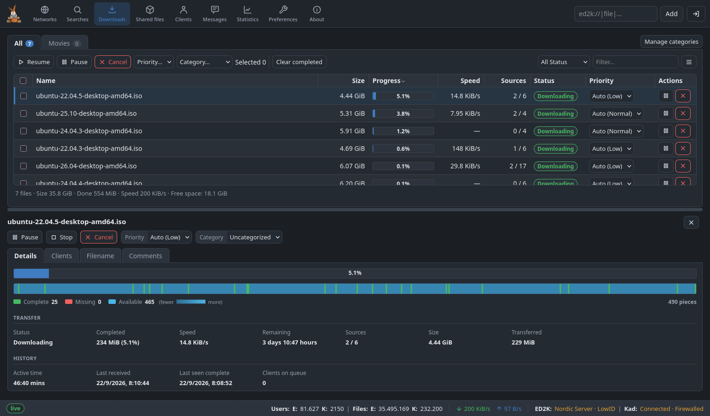
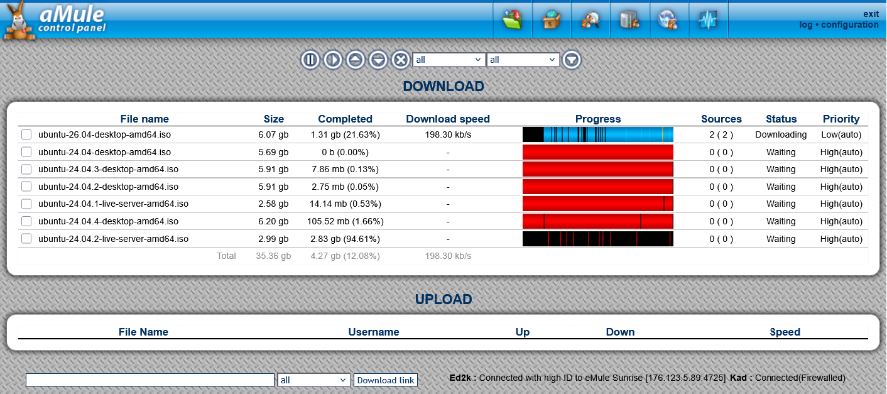

# ngosang/amule

[](https://github.com/ngosang/docker-amule/releases)
[](https://hub.docker.com/r/ngosang/amule)
[](https://hub.docker.com/r/ngosang/amule)
[](https://github.com/ngosang/docker-amule)

[](https://ko-fi.com/ngosang)

[aMule](https://github.com/amule-org/amule) is a multi-platform client for the ED2K file sharing network and based on the windows client eMule. aMule started in August 2003, as a fork of xMule, which is a fork of lMule.



## Docker Images

The image is based on `debian:trixie-slim` and compiles aMule from source code.

Docker images are available in [DockerHub](https://hub.docker.com/r/ngosang/amule) and [GHCR](https://github.com/users/ngosang/packages/container/package/amule).

```bash
docker pull ngosang/amule
# or
docker pull ghcr.io/ngosang/amule
```

### Docker Tags

Stable:
* `latest` — Latest stable release.
* `3.0.1-2` — Specific stable version.

Development:
* `develop` — Latest development build (compiled from aMule master branch).
* `develop-20260512-abc1234` — Specific development build: date + aMule upstream commit.

Debug:
* `debug` — Latest debug build (compiled from aMule master branch).
* `debug-20260512-abc1234` — Specific debug build: date + aMule upstream commit.

> [!NOTE]
> The `debug` images are compiled in **Debug** mode (`CMAKE_BUILD_TYPE=Debug`, full symbols, no optimizations) and ship with the debugging tools `gdb`, `strace`, `lsof` and `heaptrack` preinstalled, so you can debug crashes and memory issues of the aMule development builds. As a result they are larger and slower than the `stable` and `develop` images and are not intended for production use. The `stable` and `develop` images are regular optimized builds without these tools.

### Supported Architectures

The architectures supported by this image are:

* linux/386
* linux/amd64
* linux/arm/v5
* linux/arm/v7
* linux/arm64/v8
* linux/ppc64le
* linux/riscv64
* linux/s390x

## Application Setup

The Web UI is at `<your-ip>:4711`. It is served by **amuleapi**, the daemon added in aMule
3.1.0: it connects to aMule over External Connections and serves the Web UI at `/` and the
REST API under `/api/v0/` on the same port.

The login form only asks for a password (there is no user name) and the password decides
the role: `WEBUI_PWD` logs in as admin (full control) and `WEBUI_GUEST_PWD`, if you set it,
as a read-only guest.

The REST API shares that port and those credentials. `POST /api/v0/auth/login` mints a JWT
and returns it as an `HttpOnly` `amuleapi_token` cookie, or in the response body when you
ask for it with `?type=bearer` (for `Authorization: Bearer` clients). The admin password
unlocks every endpoint; the guest one is read-only and gets `403` on any mutation. See the
upstream [REST reference](https://github.com/amule-org/amule/blob/master/docs/api/REFERENCE.md)
and [event stream docs](https://github.com/amule-org/amule/blob/master/docs/api/EVENTS.md).

> [!IMPORTANT]
> Set `GUI_PWD` and `WEBUI_PWD`. If you leave them out, random passwords are generated on
> the first start and only printed to the container logs (`docker logs amule`). `GUI_PWD`
> is **mandatory** when you upgrade a configuration created by an older image, see
> [Upgrading to 3.1.0](#upgrading-to-310).

> [!NOTE]
> amuleapi speaks plain HTTP, so don't expose port `4711` to the Internet directly. Put a
> reverse proxy with TLS in front of it.

The Web UI and API settings live in their own `amuleapi.conf` file in the configuration
volume (bind address, port, CORS and `StaticRoot`); the `[WebServer]` section of
`amule.conf` is only used by the legacy Web UI. Restart the container after editing it.
To serve your own Web UI bundle instead of the one shipped in the image, mount it in the
container and set `StaticRoot` to its path. Leave `StaticRoot=` empty to serve the bundled
Web UI (`/usr/share/amule/amuleapi-static`).

> [!IMPORTANT]
> Stop the container before editing `amule.conf`. aMule keeps the configuration in memory
> and rewrites the whole file on shutdown, so any change made while the container is
> running is lost on the next restart.

The previous Web UI (`amuleweb`) is deprecated and will be removed. It is still available
as a temporary fallback, see [Legacy Web UI (amuleweb)](#legacy-web-ui-amuleweb).

For better download speed you have to open these ports:

* 4662 TCP
* 4665 UDP
* 4672 UDP

## Usage

Here are some example snippets to help you get started creating a container.

> [!NOTE]
> When you start aMule all shared folders are scanned. The user interface will not be available until the process is finished. You can check the logs and CPU usage to know the status.

### docker-compose

Compatible with docker-compose v2 schemas.

```yaml
---
services:
  amule:
    image: ngosang/amule
    container_name: amule
    environment:
      - PUID=1000
      - PGID=1000
      - TZ=Europe/London
      - GUI_PWD=<fill_password>
      - WEBUI_PWD=<fill_password>
      - MOD_AUTO_RESTART_ENABLED=true
      - MOD_AUTO_RESTART_CRON=0 6 * * *
      - MOD_AUTO_SHARE_ENABLED=false
      - MOD_AUTO_SHARE_DIRECTORIES=/downloads/incoming;/my_movies
    ports:
      - "4711:4711" # Web UI and REST API (amuleapi)
      - "4712:4712" # External connections (amuleapi, amulegui, amulecmd)
      - "4662:4662" # ED2K client-to-client TCP (required for High ID)
      - "4665:4665/udp" # ED2K server UDP (global searches, TCP port +3)
      - "4672:4672/udp" # Extended eMule protocol and Kademlia UDP
    volumes:
      - <fill_amule_configuration_path>:/home/amule/.aMule
      - <fill_amule_downloads_path>:/downloads
    restart: unless-stopped
```

> [!NOTE]
> aMule stores completed downloads in `/downloads/incoming` and incomplete downloads in `/downloads/temp` inside the container. These paths can be changed with the `INCOMING_DIR` and `TEMP_DIR` environment variables. You can also mount `/downloads/incoming` and `/downloads/temp` as separate volumes, but be aware that completed files will be copied instead of moved, since they would reside on different filesystems.

### docker cli

```bash
docker run -d \
  --name=amule \
  -p 4711:4711 \
  -p 4712:4712 \
  -p 4662:4662 \
  -p 4665:4665/udp \
  -p 4672:4672/udp \
  -e PUID=1000 \
  -e PGID=1000 \
  -e TZ=Europe/London \
  -e GUI_PWD=<fill_password> `#recommended` \
  -e WEBUI_PWD=<fill_password> `#recommended` \
  -e MOD_AUTO_RESTART_ENABLED=true `#optional` \
  -e 'MOD_AUTO_RESTART_CRON=0 6 * * *' `#optional` \
  -e MOD_AUTO_SHARE_ENABLED=false `#optional` \
  -e MOD_AUTO_SHARE_DIRECTORIES=/downloads/incoming;/my_movies `#optional` \
  -v <fill_amule_configuration_path>:/home/amule/.aMule \
  -v <fill_amule_downloads_path>:/downloads \
  --restart unless-stopped \
  ngosang/amule
```

## Parameters

Container images are configured using parameters passed at runtime (such as those above). These parameters are separated by a colon and indicate `<external>:<internal>` respectively. For example, `-p 8080:80` would expose port `80` from inside the container to be accessible from the host's IP on port `8080` outside the container.

| Parameter | Function |
| :----: | --- |
| `-p 4711` | Web UI and REST API port (amuleapi). |
| `-p 4712` | External connections port (amuleapi, amulegui, amulecmd). |
| `-p 4662` | ED2K client-to-client TCP (required for High ID). It must be open to the Internet. |
| `-p 4665/udp` | ED2K server UDP (global searches, TCP port +3). It must be open to the Internet. |
| `-p 4672/udp` | Extended eMule protocol and Kademlia UDP. It must be open to the Internet. |
| `-e PUID=1000` | for UserID - see below for explanation. |
| `-e PGID=1000` | for GroupID - see below for explanation. |
| `-e UMASK=0002` | Set the umask for file creation. Optional, defaults to `0002` (files: 664, dirs: 775, group write access). |
| `-e TZ=Europe/London` | Specify a timezone to use EG Europe/London. |
| `-e GUI_PWD=<fill_password>` | Set the External Connections password, used by amuleapi, amulegui and amulecmd. It will overwrite the password in the config files. Required when upgrading a configuration created by an older image, see [Upgrading to 3.1.0](#upgrading-to-310). |
| `-e WEBUI_PWD=<fill_password>` | Set the Web UI admin password. It will overwrite the password in the config files. |
| `-e WEBUI_GUEST_PWD=<fill_password>` | Set the Web UI guest password, a read-only account. Optional, leave it empty to disable the guest account. If you remove the variable entirely, whatever was set before is kept. |
| `-e LEGACY_AMULEWEB_ENABLED=false` | Start the deprecated legacy Web UI (amuleweb) instead of amuleapi, on the same port. Optional, disabled by default. See [Legacy Web UI (amuleweb)](#legacy-web-ui-amuleweb). |
| `-e TEMP_DIR=/downloads/temp` | Path inside the container for incomplete downloads. Optional, defaults to `/downloads/temp`. |
| `-e INCOMING_DIR=/downloads/incoming` | Path inside the container for completed downloads. Optional, defaults to `/downloads/incoming`. |
| `-e FIX_PERMISSIONS=true` | Change ownership of the temp and incoming directories at startup. Optional, enabled by default. Set it to `false` on network mounts (NFS, CIFS/SMB), where the ownership is dictated by the export or the mount options and `chown` is rejected. Make sure those paths are already accessible by `PUID`/`PGID`. |
| `-e MOD_AUTO_RESTART_ENABLED=true` | Enable aMule auto restart. Check modifications section. |
| `-e 'MOD_AUTO_RESTART_CRON=0 6 * * *'` | aMule auto restart cron mask. Check modifications section. |
| `-e MOD_AUTO_SHARE_ENABLED=false` | Enable aMule auto share. Check modifications section. |
| `-e MOD_AUTO_SHARE_DIRECTORIES=/downloads/incoming;/my_movies` | aMule auto share directories with subdirectories. Check modifications section. |
| `-v /home/amule/.aMule` | Path to save aMule configuration. |
| `-v /downloads` | Path to downloads. aMule uses `/downloads/incoming` for completed downloads and `/downloads/temp` for incomplete downloads. |

## User / Group Identifiers

When using volumes (`-v` flags) permissions issues can arise between the host OS and the container, we avoid this issue by allowing you to specify the user `PUID` and group `PGID`.

Ensure any volume directories on the host are owned by the same user you specify and any permissions issues will vanish like magic.

In this instance `PUID=1000` and `PGID=1000`, to find yours use `id user` as below:

```bash
  $ id username
    uid=1000(dockeruser) gid=1000(dockergroup) groups=1000(dockergroup)
```

## Upgrading to 3.1.0

Version 3.1.0 replaces the legacy Web UI (`amuleweb`, deprecated upstream) with `amuleapi`
and its new Web UI, on the same port `4711`. Read this before upgrading, and back up your
configuration volume first.

1. **`GUI_PWD` is now mandatory if you never set it.** amuleapi needs the External
   Connections password in plain text in its own config file, because it hashes the
   password itself: the MD5 hash stored in `amule.conf` cannot be reused, it would be
   hashed twice, and upstream deliberately dropped the option to read it. So if `GUI_PWD`
   is not set and the configuration volume already has an `amule.conf`, the container
   stops on start with an explanatory error. Set `GUI_PWD` to a password of your choice
   and remember to update your `amulegui` / `amulecmd` clients with it, since the
   container rewrites it in `amule.conf`.
2. **The Web UI password is not migrated.** If `WEBUI_PWD` is not set, a new random admin
   password is generated on the first start with the new Web UI and printed to the
   container logs (`docker logs amule`). The old `amuleweb` password cannot be reused:
   `amule.conf` stores it as a plain MD5 hash, while amuleapi keeps its own salted and
   stretched digest in `amuleapi-passwords`.
3. **New files in the configuration volume**: `amuleapi.conf` (settings, including the
   plain text External Connections password), `amuleapi-passwords` (admin and guest
   passwords, salted and stretched) and `amuleapi-jwt-secret` (signs the login sessions;
   delete it to sign everyone out). amuleapi refuses to start if any of them is readable
   by group or others, so the container forces mode `600` on every start.
4. **Optional read-only account**: set `WEBUI_GUEST_PWD` to enable it, leave it empty to
   disable it. Removing the variable keeps whatever was set before.
5. **Web UI settings moved to `amuleapi.conf`.** The `[WebServer]` section of `amule.conf`
   (`Port`, `Template`, `UseGzip`, `PageRefreshTime`, ...) is ignored by amuleapi, so any
   customization there has to be redone in `amuleapi.conf`, which only has the equivalents
   for the bind address, the port and the static files. Nothing is lost, the section stays
   in `amule.conf` and is used again in legacy mode.
6. **UPnP no longer forwards the Web UI port.** Only relevant if you run with
   `network_mode: host` and had `UPnPWebServerEnabled=1`: amuleapi has no UPnP support, so
   port `4711` has to be forwarded by hand from now on. See the [UPnP](#upnp) section.

If the new Web UI gives you trouble you can roll back at any time with
`LEGACY_AMULEWEB_ENABLED=true`, see [Legacy Web UI (amuleweb)](#legacy-web-ui-amuleweb).

## UPnP

> [!NOTE]
> The normal configuration uses the default bridge networking with the `ports:` mappings shown above, forwarding those ports on your router manually if needed. Only use UPnP if your router supports it and you specifically want automatic port forwarding, or if you are stuck with a **Low ID** and cannot forward ports by hand.

aMule is compiled with UPnP support, which lets aMule automatically open the required ports on a UPnP-capable router so you get a **High ID** without manually forwarding ports.

UPnP needs direct access to the host network to talk to the router, so it only works when the container runs with **host networking**. Set `network_mode: host` and **do not** add a `ports:` section: in host networking the container shares the host network stack directly, so the `ports:` mappings are ignored.

```yaml
---
services:
  amule:
    image: ngosang/amule
    container_name: amule
    network_mode: host   # required for UPnP (do not add a `ports:` section)
    environment:
      - PUID=1000
      - PGID=1000
      - TZ=Europe/London
      - GUI_PWD=<fill_password>
      - WEBUI_PWD=<fill_password>
    volumes:
      - <fill_amule_configuration_path>:/home/amule/.aMule
      - <fill_amule_downloads_path>:/downloads
    restart: unless-stopped
```

You also have to enable UPnP in aMule itself, then restart the container. In `amule.conf` set `UPnPEnabled=1`, which forwards the eD2k TCP port (4662) and the UDP ports (4665, 4672). Optionally `UPnPECEnabled=1` forwards the External Connections port.

> [!NOTE]
> The Web UI port cannot be forwarded by UPnP: amuleapi has no UPnP support (`UPnPWebServerEnabled` belongs to the legacy Web UI). Forward `4711` by hand if you need it reachable from outside your network, behind a reverse proxy with TLS.

> [!NOTE]
> `UPnPTCPPort` (default `50000`) is **not** a forwarded port — it is the local port aMule's UPnP stack uses to communicate with the router. Leave it at the default unless it conflicts with another service. If you run a local firewall, allow local TCP `50000` and UDP `1900`.

## Modifications

The Docker image includes some unofficial features. All of them are optional.

### Auto restart mod

We have implemented a cron scheduler to restart aMule from time to time. To enable this mod set these environment variables:
* `MOD_AUTO_RESTART_ENABLED=true`
* `MOD_AUTO_RESTART_CRON=0 6 * * *` => Cron mask is configurable. In the example it restarts everyday at 6:00h.

> [!NOTE]
> Restarting aMule also restarts the Web UI: amuleapi loses its External Connections link to aMule and exits, and the supervisor starts it again a few seconds later. The `Service amuleapi terminated with exit code: 1` line you see in the logs afterwards is expected, not an error.

### Auto share mod

By default, aMule only shares the "incoming" directory and shared folders cannot be selected in the Web UI.

We have added this option in the Docker image. The configuration is updated when the container starts. It writes the listed directories as recursive shared roots (`shareddir-recursive.dat`), so aMule shares each directory together with **all of its sub-directories**. New sub-directories created later are shared automatically too (see `AutoRescanSharedDirs` below). aMule regenerates `shareddir.dat` (the union of all shared directories) on startup.
* `MOD_AUTO_SHARE_ENABLED=true`
* `MOD_AUTO_SHARE_DIRECTORIES=/downloads/incoming;/my_movies` => List of directories separated by semicolon ';'. Subdirectories will be shared too.

#### Shared directories scanning

These options are enabled by default in the generated `amule.conf` and control how aMule scans the shared directories. You can change them by editing `amule.conf` in the config volume.
* `AutoRescanSharedDirs=1` => aMule watches the shared directories and detects changes (new files and sub-directories) automatically, without a manual "Reload shared files". New sub-directories under a recursive root are shared on the fly. Set to `0` to disable the watcher.
* `FollowSymlinksInShares=1` => aMule follows symbolic links while scanning the shared directories. Set to `0` to skip symlinked files and directories entirely.

## Legacy Web UI (amuleweb)

> [!WARNING]
> `amuleweb` is deprecated upstream and will be removed from aMule, and from this image,
> in a future release. It is kept only as a fallback while the new Web UI matures, so
> please migrate to amuleapi instead of settling here.

Set `LEGACY_AMULEWEB_ENABLED=true` and the container starts `amuleweb` instead of
`amuleapi`, on the same port `4711`. The amuleapi files in the configuration volume are
left untouched, so removing the variable switches back to the new Web UI. Note that
nothing amuleapi needs is created while this mode is on, so switching back on an existing
configuration still requires `GUI_PWD`, see [Upgrading to 3.1.0](#upgrading-to-310).

In this mode the Web UI password is the `WEBUI_PWD` one stored in `amule.conf`, and there
is no REST API and no read-only guest account (`WEBUI_GUEST_PWD` is ignored).

<details>
<summary>Screenshot of the legacy Web UI</summary>



</details>

### Custom theme

The Docker image ships with the default aMule Web UI theme. The previously bundled
[AmuleWebUI-Reloaded](https://github.com/MatteoRagni/AmuleWebUI-Reloaded) theme has been
removed because it is not compatible with aMule 3.0.0.

You can still use a custom theme by mounting it as an external volume inside the web
server templates directory (`/usr/share/amule/webserver/<ThemeName>`) and pointing the
`Template` option to it in the `amule.conf` file:

```yaml
services:
  amule:
    # ... rest of the service definition ...
    volumes:
      - /path/to/my-theme:/usr/share/amule/webserver/MyTheme
```

Then edit the `amule.conf` file (with the container stopped) and set `Template=MyTheme`.
Leave `Template=` empty to use the default theme. The theme directory must contain
`login.php` at its root, otherwise aMule silently falls back to the default theme.
